# 🧪 sgu25_KTPM — Repository Kiểm Thử Phần Mềm

<p align="center" style="display: flex; justify-content: center; gap: 20px; align-items: center;">
  
  
</p>

<p align="center">
  <a href="https://img.shields.io/badge/status-active-brightgreen">
    
  </a>
  <a href="https://img.shields.io/badge/semester-2025-blue">
    
  </a>
  <a href="https://img.shields.io/badge/license-MIT-informational">
    
  </a>
  <a href="https://img.shields.io/badge/language-C%2B%2B-00599C?logo=c%2B%2B">
    
  </a>
  <a href="https://img.shields.io/badge/python-3.8+-3776AB?logo=python">
    
  </a>
</p>

---

## 👨‍🎓 Thông tin

<table>
<tr>
<td><strong>👤 Tác giả</strong></td>
<td>Trương Phú Kiệt</td>
<td><strong>🏫 Trường</strong></td>
<td>Trường Đại học Sài Gòn (SGU)</td>
</tr>
<tr>
<td><strong>🆔 MSSV</strong></td>
<td>3122411109</td>
<td><strong>📚 Môn học</strong></td>
<td>Kiểm thử phần mềm (Software Testing)</td>
</tr>
<tr>
<td><strong>👨‍🏫 Giảng viên</strong></td>
<td>TS. Đỗ Như Tài</td>
<td><strong>📅 Năm học</strong></td>
<td>2024-2025 (Học kỳ 1)</td>
</tr>
<tr>
<td><strong>🔧 Ngôn ngữ</strong></td>
<td>C++17, Python 3.8+</td>
<td><strong>📊 Tổng bài tập</strong></td>
<td>5 Labs + 7 Bài tập + Đề tài chính</td>
</tr>
</table>

---

## 🧩 Giới thiệu
Repository phục vụ môn **Kiểm thử phần mềm**, lưu trữ:
- Bài tập, lab và ví dụ minh họa về kiểm thử.
- Mã nguồn test (unit, integration, E2E) và báo cáo kết quả.
- Tài liệu, quy ước và checklist test.

---

## 🎬 Demo & Overview

<div align="center">

### 🚀 Tổng quan Repository - Quick Demo


*Video demo tổng quan: Cấu trúc repository, các Labs, Bài tập, và tính năng chính của sgu25_KTPM*

**📌 Highlights trong demo:**
- 📁 Cấu trúc thư mục rõ ràng với 5 Labs + 7 Bài tập
- 💻 8 file C++ với các bài tập White-box Testing
- 📓 6 Jupyter Notebooks minh họa kết quả
- 🎨 7+ sơ đồ Draw.io chuyên nghiệp (BPMN, ERD, UML)
- 📊 15 hình ảnh minh họa chi tiết
- 🤖 Automation script với bash
- 📚 Documentation đầy đủ 3500+ lines

</div>

---

## 📚 Mục lục

- [Demo & Overview](#-demo--overview)
- [Tổng quan](#-tổng-quan)
- [Cấu trúc thư mục](#-cấu-trúc-thư-mục)
- [Nội dung chi tiết](#-nội-dung-chi-tiết)
  - [Đề tài chính](#1-đề-tài-chính-detai)
  - [Bài tập Lab](#2-bài-tập-lab)
  - [Bài tập lý thuyết](#3-bài-tập-lý-thuyết)
- [Môi trường phát triển](#️-môi-trường-phát-triển)
- [Hướng dẫn sử dụng](#-hướng-dẫn-sử-dụng)
- [Chiến lược kiểm thử](#-chiến-lược-kiểm-thử)
- [Kỹ thuật kiểm thử áp dụng](#-kỹ-thuật-kiểm-thử-áp-dụng)
- [Công cụ & Automation](#️-công-cụ--automation)
- [Checklist nộp bài](#-checklist-nộp-bài)
- [Thống kê Repository](#-thống-kê-repository)
- [Hướng dẫn nâng cao](#-hướng-dẫn-nâng-cao)
- [Tài liệu tham khảo](#-tài-liệu-tham-khảo)
- [Liên hệ](#-liên-hệ)

---

## 🎯 Tổng quan

<div align="center">

### 🎓 Về Repository này


*Software Testing - Finding bugs before users do! 🐛🔍*

</div>

Repository **`sgu25_KTPM`** là kho lưu trữ **toàn diện và chuyên nghiệp** cho môn **Kiểm thử phần mềm (Software Testing)** tại Trường Đại học Sài Gòn. Được xây dựng với mục tiêu học tập và thực hành sâu các kỹ thuật kiểm thử phần mềm hiện đại.

### 🎯 Mục tiêu học tập

| Lĩnh vực | Nội dung |
|----------|----------|
| **🔬 Kiểm thử hộp trắng** | Statement, Branch, Path Coverage - White-box Testing |
| **🎲 Kiểm thử hộp đen** | Equivalence Partitioning, Boundary Value Analysis - Black-box Testing |
| **📊 Kiểm thử nâng cao** | Decision Table, State Transition, Pairwise Testing |
| **📋 Quy trình kiểm thử** | Test Planning, Test Case Design, Bug Reporting |
| **🏗️ Phân tích & Thiết kế** | Business Process, Use Case, ERD, UI Design |
| **🤖 Automation** | Scripts, CI/CD, Test Automation |

### 📦 Nội dung chính

- ✅ **Đề tài chính**: Phân tích, thiết kế và lập kế hoạch kiểm thử cho hệ thống phần mềm hoàn chỉnh
- ✅ **5 Labs thực hành**: Từ White-box đến Black-box Testing, Test Planning
- ✅ **7 Bài tập lý thuyết**: Decision Table, State Transition, Process Testing
- ✅ **Mã nguồn C++**: 8 chương trình mẫu với bug thực tế để thực hành
- ✅ **Tài liệu kiểm thử**: Test Plan, Test Cases, Bug Reports theo chuẩn IEEE 829
- ✅ **Sơ đồ thiết kế**: Business Process (BPMN), Use Case, ERD, UI Mockups
- ✅ **Automation Scripts**: Biên dịch và test tự động với Bash scripts
- ✅ **Jupyter Notebooks**: 6 notebooks minh họa kết quả kiểm thử

### 🏆 Điểm nổi bật

<table>
<tr>
<td align="center">📁</td>
<td><strong>Cấu trúc rõ ràng</strong><br>Tổ chức theo từng lab và bài tập riêng biệt</td>
<td align="center">📝</td>
<td><strong>Tài liệu đầy đủ</strong><br>Mỗi lab có test cases & báo cáo chi tiết</td>
</tr>
<tr>
<td align="center">💻</td>
<td><strong>Code thực tế</strong><br>Có bug thật để học cách phát hiện lỗi</td>
<td align="center">🤖</td>
<td><strong>Automation</strong><br>Scripts tự động build & test</td>
</tr>
<tr>
<td align="center">🎨</td>
<td><strong>Sơ đồ chuyên nghiệp</strong><br>Draw.io diagrams cho tất cả phases</td>
<td align="center">📊</td>
<td><strong>Coverage đầy đủ</strong><br>Statement, Branch, Path coverage</td>
</tr>
</table>

---

## 📁 Cấu trúc thư mục

```
sgu25_KTPM/
│
├── 📄 README.md                      # 📖 File hướng dẫn tổng quan (file này)
├── 🖼️  KTPM.png                      # 🎨 Logo môn học Kiểm thử phần mềm
├── 🖼️  sgu.png                       # 🎨 Logo Trường Đại học Sài Gòn
├── 📓 test_readme.ipynb              # 🧪 Jupyter Notebook test và demo README
├── 📝 Sơ lược về 4 giai đoạn rã code.docx
│
├── 📂 image/                         # 🖼️ Thư mục chứa hình ảnh minh họa
│   ├── Lab1_Exercise.png            # Lab 1: Bài tập White-box Testing
│   ├── TracNghiemLab1.png           # Lab 1: Trắc nghiệm lý thuyết
│   ├── Lab02_MucLuc.png             # Lab 2: Mục lục báo cáo
│   ├── Lab02.png                    # Lab 2: Nội dung phân tích & thiết kế
│   ├── Lab03_MucLuc.png             # Lab 3: Mục lục Use Case & UML
│   ├── Lab3_C4Model.png             # Lab 3: C4 Model architecture
│   ├── Lab04_MucLuc.png             # Lab 4: Mục lục Test Plan
│   ├── Lab04_TestPlan.png           # Lab 4: Mẫu Test Plan
│   ├── Lab05_KiemThuMienTuongDuong.png  # Lab 5: Equivalence Partitioning
│   ├── BT06_KiemThuBangQuyetDinh.png    # BT06: Decision Table Testing
│   ├── BT06_KiemThuTrangThai.png        # BT06: State Transition & Pairwise
│   ├── BT07_KiemThuQuyTrinh.png         # BT07: Process Testing
│   └── 4GiaiDoanPhanRaCode.png          # Sơ đồ 4 giai đoạn phân rã code
│
├── 📂 .vscode/                       # ⚙️ Cấu hình VS Code
│   ├── tasks.json                   # Build tasks cho C++ (g++.exe)
│   └── settings.json                # Workspace settings
│
├── 📂 .git/                          # 🌿 Git repository & version control
│
├── 📂 DeTai/                         # 🎯 ĐỀ TÀI CHÍNH
│   │
│   ├── 📂 DeTai_GiaiDoan1/          # ✅ GIAI ĐOẠN 1: Phân tích & Thiết kế
│   │   │
│   │   ├── 📄 DeTai_GiaiDoan1_TruongPhuKiet_3122411109.docx  # 📝 Báo cáo chính (nộp)
│   │   ├── 📄 DeTai_GiaiDoan1_HoTen_MaSV.docx                # 📋 Template gốc
│   │   │
│   │   ├── 🎨 Business_Process_FOG.drawio      # 📊 Sơ đồ quy trình nghiệp vụ (BPMN)
│   │   ├── 🗂️  conceptual_model_final.drawio   # 🗄️ Mô hình khái niệm/ERD
│   │   ├── 🎨 ScreenDesign.drawio              # 🖥️ Thiết kế giao diện/UI Mockups
│   │   │
│   │   ├── 📊 ScreenDesign.xlsx                # 📋 Chi tiết màn hình & chức năng
│   │   ├── 📊 UseCase.xlsx                     # 📋 Danh sách Use Cases đầy đủ
│   │   │
│   │   ├── 📝 Test_Plan_Template.dotx          # 📑 Mẫu Test Plan (IEEE 829)
│   │   ├── 📝 Phan_Tich_Quy_Trinh_Nghiep_Vu.docx  # 📄 Phân tích quy trình
│   │   │
│   │   ├── 📑 CNPM - Bai Tap 1 - Phan Tich Qui Trinh Phan mem.pdf
│   │   ├── 📑 KTPM - Đánh giá đề tài - Sáng 5 - 20251009.pdf
│   │   └── 📝 trình bày word.txt               # 📋 Đề cương trình bày (Chương 1,2,3)
│   │
│   ├── 📂 DeTai01/                  # 📐 Đề tài phụ 1: Phân tích hệ thống
│   │   ├── 📄 DeTai01-Phan tich-TruongPhuKiet-3122411109.docx
│   │   ├── 🎨 DeTai01-Phan tich-TruongPhuKiet-3122411109.drawio
│   │   └── 📊 DeTai01-Phan tich-TruongPhuKiet-3122411109.pptx
│   │
│   └── 📂 DeTai02/                  # 🏗️  Đề tài phụ 2: Thiết kế kiến trúc
│       └── 📄 DeTai_Buoc02_ThietKeKienTruc_TruongPhuKiet-3122411109.docx
│
├── 📂 lab1/                          # 🧪 LAB 1: Kiểm thử hộp trắng (White-box Testing)
│   │                                 # 🎯 Mục tiêu: Statement/Branch/Path Coverage
│   │
│   ├── 💻 baia.cpp                  # ✅ Bài A: Kiểm thử f1() - Boundary Value Analysis
│   ├── 💻 baib.cpp                  # ✅ Bài B: Kiểm thử f2() - Command-line Arguments
│   ├── 💻 baic.cpp                  # ⚠️ Bài C: Kiểm thử f2() - Dead Code Detection
│   ├── 💻 baid.cpp                  # 🔢 Bài D: Kiểm thử f3() - Hàm toán học (log, cos)
│   ├── 💻 baie.cpp                  # 🐛 Bài E: Tìm lỗi findMax() - Bug Detection
│   │
│   ├── 💻 bai2_2.cpp                # 📝 Bài tập bổ sung 2.2
│   ├── 💻 bai2_3.cpp                # 📝 Bài tập bổ sung 2.3
│   ├── 💻 tempCodeRunnerFile.cpp    # 🗑️ File temp (có thể bỏ qua)
│   │
│   ├── ⚙️  baia.exe                  # 🔧 File thực thi (build artifacts)
│   ├── ⚙️  baib.exe
│   ├── ⚙️  baic.exe
│   ├── ⚙️  baid.exe
│   ├── ⚙️  baie.exe
│   ├── ⚙️  bai2_2tests.exe
│   ├── ⚙️  bai2_3tests.exe
│   │
│   ├── 📓 baia.ipynb                # 🧪 Jupyter Notebook - Minh họa & test baia
│   ├── 📓 baib.ipynb                # 🧪 Jupyter Notebook - Minh họa & test baib
│   ├── 📓 baic.ipynb                # 🧪 Jupyter Notebook - Minh họa & test baic
│   ├── 📓 baid.ipynb                # 🧪 Jupyter Notebook - Minh họa & test baid
│   ├── 📓 baie.ipynb                # 🧪 Jupyter Notebook - Minh họa & test baie
│   ├── 📓 bai2.ipynb                # 🧪 Jupyter Notebook - Tổng hợp
│   │
│   ├── 📄 Lab1_VV_TestCases.docx    # ✅ Test Cases chi tiết cho Lab 1 (chính thức)
│   ├── 📑 BaiTap1 - VV - TestCases.pdf  # 📄 Test Cases (PDF version)
│   └── 📄 TracNghiem1_TRƯƠNG PHÚ KIỆT_3122411109.docx  # 📝 Trắc nghiệm lý thuyết
│
├── 📂 Lab2/                          # 📐 LAB 2: Phân tích & Thiết kế hệ thống (PTTKHT)
│   ├── 📄 Lab2_PTTKHT_TruongPhuKiet_3122411109.docx  # 📝 Báo cáo
│   └── 🎨 Lab2_PTTKHT_TruongPhuKiet_3122411109.drawio  # 📊 Sơ đồ thiết kế
│
├── 📂 Lab3/                          # 📊 LAB 3: Use Case, Activity & Sequence Diagram
│   ├── 📄 BT3_PTTKHT_TruongPhuKiet_3122411109.docx  # 📝 Báo cáo
│   └── 🎨 BT3_PTTKHT_TruongPhuKiet_3122411109.drawio  # 📊 Sơ đồ UML
│
├── 📂 Lab4/                          # 📝 LAB 4: Test Plan Templates (IEEE 829)
│   ├── 📄 ABC Project Test Plan_0.2-template.doc      # 📋 Mẫu Test Plan 1
│   ├── 📄 ABC Project Test Plan_0.2-template.docx     # 📋 Mẫu Test Plan 1 (DOCX)
│   └── 📄 INTERNATIONAL-KIDS.COM DEVELOPMENT PROJECT_Test plan.doc  # 📋 Mẫu 2
│
├── 📂 Lab5/                          # 🔍 LAB 5: Kiểm thử hộp đen (Black-box Testing)
│   ├── 📄 BT05_KiemThuMienTuongDuong_HoTen_MaSV.doc   # 📝 Equivalence Partitioning
│   ├── 📑 Class_exercise_LT.pdf                        # 📝 Bài tập trên lớp
│   └── 📑 KTPM - Chuong 4 - Kiem thu hop den.pdf      # 📚 Slide lý thuyết Chương 4
│
├── 📂 BT06_KiemThuHopDen2_TruongPhuKie_3122411109/  # 📋 BÀI TẬP 6: Kiểm thử nâng cao
│   ├── 📄 BT06_01_KiemThuBangQuyetDinh-3.docx         # 🎲 Decision Table Testing
│   ├── 📄 BT06_02_KiemThuTrangThai_Pairwise.docx      # 🔄 State Transition & Pairwise
│   └── 📄 BT06_LyThuyet.docx                          # 📚 Lý thuyết tổng hợp
│
├── 📊 BT7_KiemThuQuiTrinh_TruongPhuKiet_3122411109.xlsx  # 📋 BÀI TẬP 7: Process Testing
│
└── 📂 scripts/                       # 🔧 SCRIPTS TỰ ĐỘNG HÓA
    └── 🐚 run_lab1_tests.sh         # ⚡ Script biên dịch & chạy test tự động (Bash)
                                      # 🎯 Build tất cả .cpp, log ra logs/ folder
```

### 📊 Tổng hợp nội dung

<table>
<tr>
<th>📁 Thư mục/File</th>
<th>📈 Số lượng</th>
<th>📝 Mô tả</th>
<th>⚙️ Công nghệ</th>
</tr>
<tr>
<td><strong>DeTai/</strong></td>
<td>3 giai đoạn<br>15+ files</td>
<td>Đề tài chính - Phân tích, thiết kế, kiến trúc hệ thống phần mềm hoàn chỉnh</td>
<td>Draw.io, Word, Excel, PDF</td>
</tr>
<tr>
<td><strong>lab1/</strong></td>
<td>8 .cpp<br>7 .exe<br>6 .ipynb<br>3 docs</td>
<td>Kiểm thử hộp trắng (White-box) - Coverage Testing với C++</td>
<td>C++17, Jupyter, g++</td>
</tr>
<tr>
<td><strong>Lab2/</strong></td>
<td>2 files</td>
<td>Phân tích & thiết kế hệ thống (PTTKHT)</td>
<td>Draw.io, Word</td>
</tr>
<tr>
<td><strong>Lab3/</strong></td>
<td>2 files</td>
<td>Use Case, Activity, Sequence Diagrams</td>
<td>Draw.io, UML</td>
</tr>
<tr>
<td><strong>Lab4/</strong></td>
<td>3 templates</td>
<td>Mẫu Test Plan chuẩn công nghiệp (IEEE 829)</td>
<td>Word Templates</td>
</tr>
<tr>
<td><strong>Lab5/</strong></td>
<td>3 files</td>
<td>Kiểm thử hộp đen - Equivalence Partitioning, BVA</td>
<td>Word, PDF</td>
</tr>
<tr>
<td><strong>BT06/</strong></td>
<td>3 files</td>
<td>Decision Table, State Transition, Pairwise Testing</td>
<td>Word</td>
</tr>
<tr>
<td><strong>BT07</strong></td>
<td>1 file Excel</td>
<td>Kiểm thử quy trình (Process/Workflow Testing)</td>
<td>Excel</td>
</tr>
<tr>
<td><strong>scripts/</strong></td>
<td>1 bash script</td>
<td>Automation: biên dịch & test C++ tự động</td>
<td>Bash, Shell</td>
</tr>
<tr>
<td><strong>Tổng cộng</strong></td>
<td><strong>50+ files</strong></td>
<td colspan="2"><strong>Đầy đủ: Code, Docs, Diagrams, Tests, Reports</strong></td>
</tr>
</table>

---

## 📖 Nội dung chi tiết

### 1. Đề tài chính (DeTai/)

#### 🎯 Mục tiêu
Phát triển một hệ thống phần mềm hoàn chỉnh từ phân tích đến kiểm thử, bao gồm:

#### 📂 DeTai_GiaiDoan1/ - Giai đoạn 1

**Phân tích yêu cầu & Thiết kế hệ thống:**

1. **Business Process** (`Business_Process_FOG.drawio`)
   - Sơ đồ quy trình nghiệp vụ (Business Workflow)
   - Mô tả các hoạt động và actors trong hệ thống
   - Export sang PNG/SVG để đưa vào báo cáo

2. **Conceptual Model** (`conceptual_model_final.drawio`)
   - Mô hình khái niệm dữ liệu
   - ERD (Entity-Relationship Diagram)
   - Data Dictionary và business rules

3. **UI Design** (`ScreenDesign.drawio` + `ScreenDesign.xlsx`)
   - Mockup giao diện người dùng
   - Danh sách các màn hình và chức năng
   - Workflow điều hướng giữa các màn

4. **Use Cases** (`UseCase.xlsx`)
   - Danh sách các use case
   - Actors và mô tả chức năng
   - Traceability matrix

5. **Test Plan** (`Test_Plan_Template.dotx`)
   - Mẫu kế hoạch kiểm thử chuẩn IEEE 829
   - Các phần: Scope, Objectives, Resources, Schedule
   - Test Strategy và Entry/Exit Criteria

**Tài liệu hỗ trợ:**
- `DeTai_GiaiDoan1_TruongPhuKiet_3122411109.docx`: Báo cáo tổng hợp đầy đủ
- `Phan_Tich_Quy_Trinh_Nghiep_Vu.docx`: Chi tiết phân tích quy trình
- `trình bày word.txt`: Đề cương trình bày (Chương 1, 2, 3)

#### 📂 DeTai01/ - Phân tích hệ thống
- Tài liệu phân tích chi tiết (Word, PowerPoint, Draw.io)
- Business requirements và system analysis

#### 📂 DeTai02/ - Thiết kế kiến trúc
- Thiết kế kiến trúc hệ thống
- Component diagram và deployment diagram

---

### 2. Bài tập Lab

#### 🧪 Lab 1: Kiểm thử hộp trắng (White-box Testing)

**Mục tiêu:** Thực hành các kỹ thuật kiểm thử hộp trắng, bao phủ Statement, Branch, Path Coverage

<div align="center">
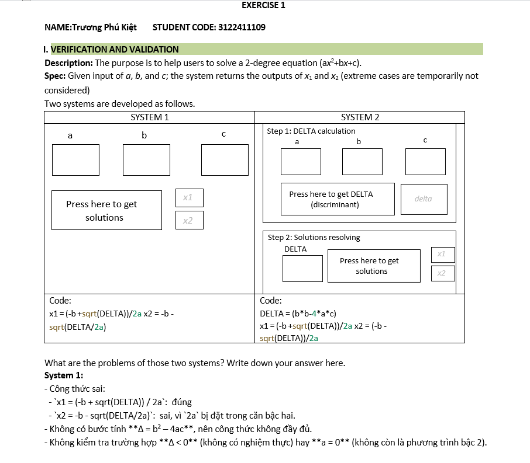

*Hình 1: Tổng quan bài tập Lab 1 - Các bài tập từ A đến E với test cases và kỹ thuật kiểm thử khác nhau*
</div>

**Các bài tập:**

| File | Mô tả | Kỹ thuật kiểm thử |
|------|-------|------------------|
| `baia.cpp` | Hàm f1(x): if-else đơn giản | Boundary Value Analysis |
| `baib.cpp` | Hàm f2(x): nested if-else | Branch Coverage |
| `baic.cpp` | Hàm f2(x): có dead code | Dead Code Detection |
| `baid.cpp` | Hàm f3(x): toán học phức tạp (log, cos) | Complex Condition Testing |
| `baie.cpp` | Hàm findMax(): tìm max 3 số (có bug) | Equivalence Partitioning |

<div align="center">
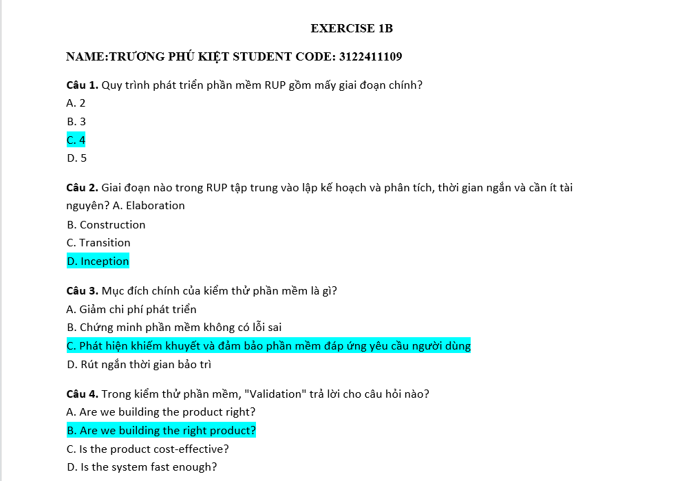

*Hình 2: Bài trắc nghiệm lý thuyết Lab 1 - Kiểm tra kiến thức về White-box Testing*
</div>

**Chi tiết từng bài:**

1. **baia.cpp** - Kiểm thử boundary values
   ```cpp
   int f1(int x) {
       if (x > 10) return 2 * x;
       else return -x;
   }
   ```
   - Test cases: x = 9, 10, 11 (boundary values)
   - Kiểm tra điều kiện x > 10

2. **baib.cpp** - Kiểm thử với command-line arguments
   ```cpp
   int f2(int x) {
       if (x > 10) return 2 * x;
       else if (x > 0) return -x;
       else return 2 * x;
   }
   ```
   - Nhận input từ argv[1]
   - Test: x > 10, 0 < x ≤ 10, x ≤ 0

3. **baic.cpp** - Phát hiện dead code
   ```cpp
   int f2(int x) {
       if (x < 10) return 2 * x;
       else if (x < 2) return -x;  // Dead code!
       else return 2 * x;
   }
   ```
   - Điều kiện `x < 2` không bao giờ đạt được

4. **baid.cpp** - Kiểm thử hàm toán học
   ```cpp
   int f3(int x) {
       if (log(x*x*cos(x)) < 3*x) return 2*x;
       else return 2*x;
   }
   ```
   - Test edge cases: x = 0, x = 3
   - Xử lý NaN, -inf trong log()

5. **baie.cpp** - Tìm lỗi trong hàm findMax()
   ```cpp
   int findMax(int num1, int num2, int num3) {
       int max = 0;  // Bug: khởi tạo = 0!
       if ((num1 > num2) && (num1 > num3)) max = num1;
       if ((num2 > num1) && (num2 > num3)) max = num2;
       if ((num3 > num1) && (num3 > num2)) max = num3;
       return max;
   }
   ```
   - Bug 1: max khởi tạo = 0 (sai khi tất cả số âm)
   - Bug 2: Không xử lý trường hợp hai số bằng nhau
   - Test cases: (-5,-2,-9), (5,5,3), (4,4,4)

**Tài liệu:**
- `Lab1_VV_TestCases.docx`: Test cases chi tiết
- `*.ipynb`: Notebooks minh họa kết quả

---

#### 📐 Lab 2: Phân tích & Thiết kế hệ thống

**Mục tiêu:** Thực hành phân tích yêu cầu phần mềm và thiết kế kiến trúc hệ thống

<div align="center">
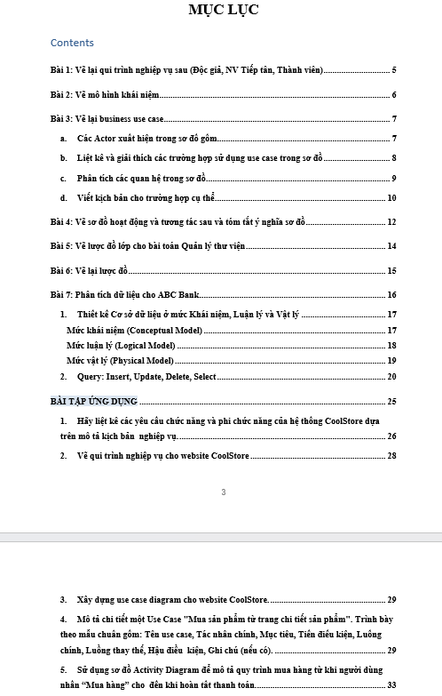

*Hình 3: Mục lục Lab 2 - Cấu trúc bài báo cáo phân tích và thiết kế hệ thống*
</div>

<div align="center">
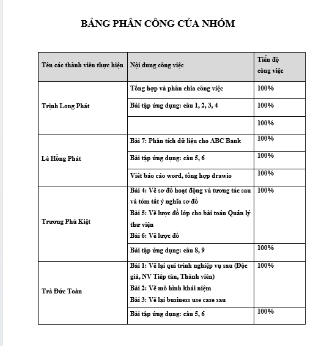

*Hình 4: Nội dung Lab 2 - Phân tích yêu cầu, thiết kế kiến trúc, workflow diagrams*
</div>

**Nội dung:**
- Phân tích yêu cầu phần mềm
- Thiết kế kiến trúc và workflow
- Sơ đồ Draw.io minh họa (Business Process, Component Diagram)

---

#### 📊 Lab 3: Use Case & Activity Diagram

**Mục tiêu:** Vẽ các sơ đồ UML và C4 Model cho hệ thống

<div align="center">


*Hình 5: Mục lục Lab 3 - Use Case Diagram, Activity Diagram, Sequence Diagram*
</div>

<div align="center">
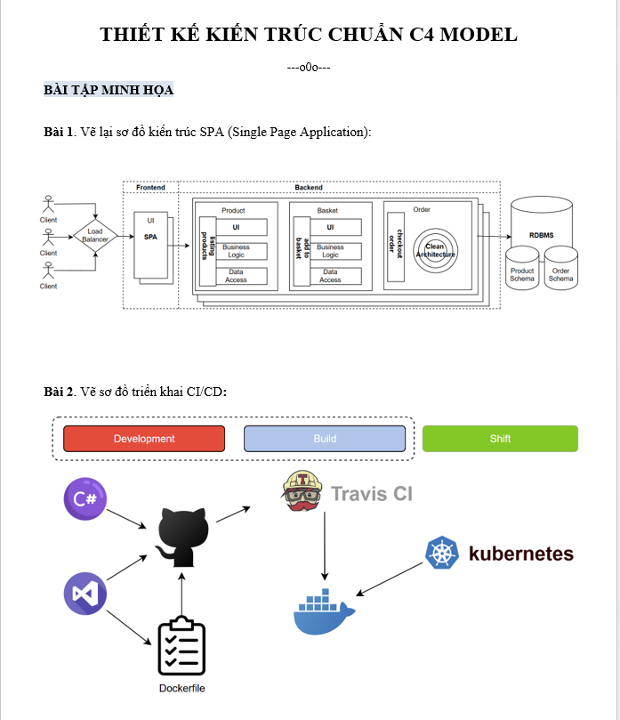

*Hình 6: Lab 3 C4 Model - Mô hình kiến trúc phần mềm theo chuẩn C4 (Context, Container, Component, Code)*
</div>

**Nội dung:**
- Vẽ Use Case Diagram
- Activity Diagram (luồng hoạt động)
- Sequence Diagram (tương tác giữa các đối tượng)
- C4 Model (kiến trúc phần mềm 4 tầng)
- File `.drawio` và `.docx` báo cáo

---

#### 📝 Lab 4: Test Plan Templates

**Mục tiêu:** Học cách viết Test Plan theo chuẩn IEEE 829

<div align="center">
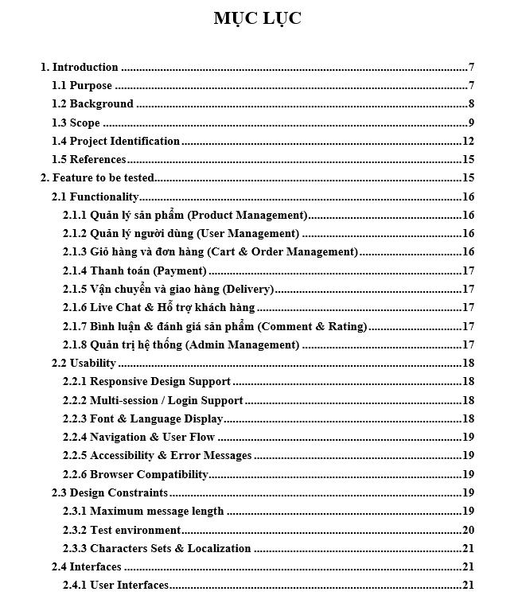

*Hình 7: Mục lục Lab 4 - Cấu trúc Test Plan theo chuẩn IEEE 829*
</div>

<div align="center">
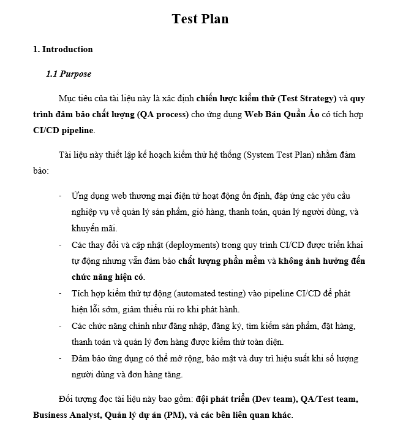

*Hình 8: Mẫu Test Plan chi tiết - Scope, Objectives, Test Strategy, Resources, Schedule*
</div>

**Nội dung:**
- Các mẫu Test Plan chuẩn công nghiệp
- Template từ dự án thực tế (ABC Project, International Kids)
- Hướng dẫn viết Test Plan theo IEEE 829
- Test Deliverables, Entry/Exit Criteria

---

#### 🔍 Lab 5: Kiểm thử hộp đen (Black-box Testing)

**Mục tiêu:** Áp dụng các kỹ thuật Black-box Testing

<div align="center">
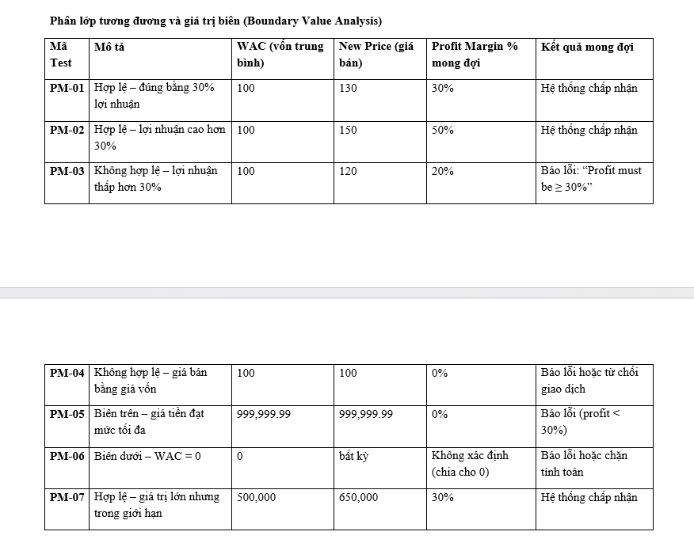

*Hình 9: Lab 5 - Kiểm thử miền tương đương (Equivalence Partitioning) và phân tích giá trị biên (BVA)*
</div>

**Nội dung:**
- Equivalence Partitioning (Phân vùng tương đương)
- Boundary Value Analysis (Phân tích giá trị biên)
- Decision Table Testing
- Tài liệu lý thuyết: `KTPM - Chuong 4 - Kiem thu hop den.pdf`

---

### 3. Bài tập lý thuyết

#### 📋 BT06: Kiểm thử hộp đen nâng cao

**Mục tiêu:** Áp dụng các kỹ thuật kiểm thử nâng cao

<div align="center">
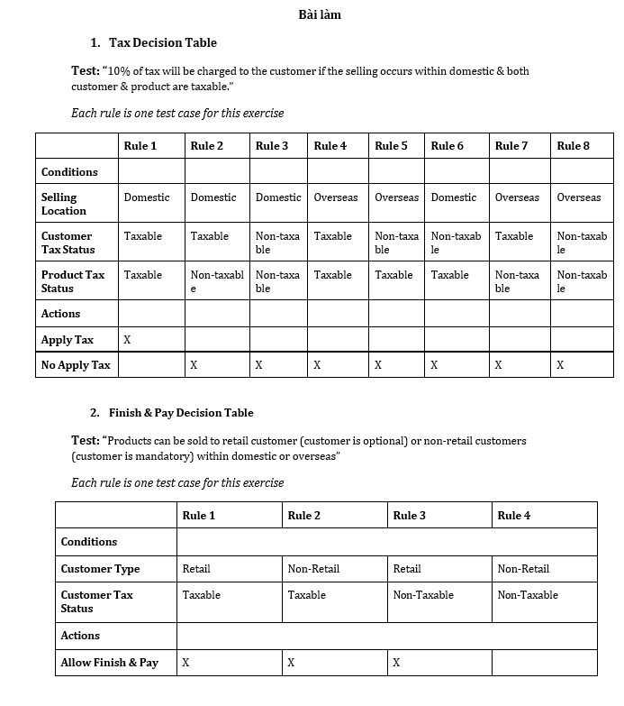

*Hình 10: BT06 Phần 1 - Decision Table Testing (Kiểm thử bảng quyết định) - Xác định test cases từ bảng quyết định với các điều kiện và hành động*
</div>

<div align="center">
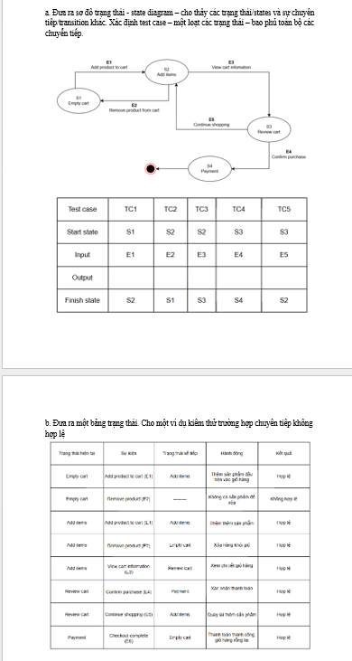

*Hình 11: BT06 Phần 2 - State Transition Testing & Pairwise Testing - Kiểm thử chuyển đổi trạng thái và kỹ thuật All-Pairs*
</div>

**Nội dung:**

1. **Decision Table Testing** (`BT06_01_KiemThuBangQuyetDinh-3.docx`)
   - Bảng quyết định (Decision Table)
   - Xác định test cases từ decision table
   - Rút gọn bảng quyết định
   - Coverage criteria

2. **State Transition & Pairwise** (`BT06_02_KiemThuTrangThai_Pairwise.docx`)
   - State Transition Testing (Kiểm thử chuyển trạng thái)
   - State Diagram và Transition Table
   - Pairwise Testing (All-pairs combinatorial testing)
   - Giảm số test cases với Pairwise

3. **Lý thuyết** (`BT06_LyThuyet.docx`)
   - Các khái niệm nâng cao về Black-box Testing
   - So sánh các kỹ thuật

---

#### 📊 BT07: Kiểm thử quy trình

**Mục tiêu:** Kiểm thử workflow và business process

<div align="center">
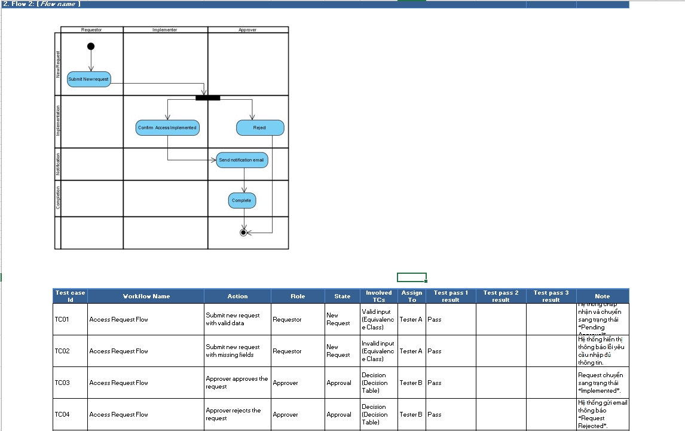

*Hình 12: BT07 - Process Testing - Kiểm thử quy trình nghiệp vụ với các bước và điều kiện trong workflow*
</div>

**Nội dung:**
- File Excel: `BT7_KiemThuQuiTrinh_TruongPhuKiet_3122411109.xlsx`
- Kiểm thử workflow/process testing
- Business Process Model Testing
- Test cases cho từng bước trong quy trình

---

## 🛠️ Môi trường phát triển

### 💻 Yêu cầu hệ thống

<table>
<tr>
<th>Thành phần</th>
<th>Yêu cầu</th>
<th>Phiên bản đề nghị</th>
<th>Ghi chú</th>
</tr>
<tr>
<td><strong>🖥️ Hệ điều hành</strong></td>
<td>Windows 10/11</td>
<td>Windows 11 Pro</td>
<td>WSL2/Linux cũng được hỗ trợ</td>
</tr>
<tr>
<td><strong>🔧 C++ Compiler</strong></td>
<td>g++ (MinGW-w64/GCC)</td>
<td>GCC 11.0+</td>
<td><code>C:\Program Files (x86)\Dev-Cpp\MinGW64\bin\g++.exe</code></td>
</tr>
<tr>
<td><strong>📝 IDE chính</strong></td>
<td>Visual Studio Code</td>
<td>Latest stable</td>
<td>Lightweight, nhiều extensions</td>
</tr>
<tr>
<td><strong>🐍 Python</strong></td>
<td>Python 3.8+</td>
<td>Python 3.11+</td>
<td>Cho Jupyter Notebooks</td>
</tr>
<tr>
<td><strong>📓 Jupyter</strong></td>
<td>Jupyter Notebook</td>
<td>Latest</td>
<td><code>pip install jupyter</code></td>
</tr>
<tr>
<td><strong>🌿 Version Control</strong></td>
<td>Git</td>
<td>2.40+</td>
<td>Git Bash cho scripts</td>
</tr>
</table>

### 🔌 VS Code Extensions (Bắt buộc)

```json
{
  "recommendations": [
    "ms-vscode.cpptools",           // C/C++ IntelliSense, debugging
    "ms-vscode.cpptools-extension-pack",  // C++ extension pack
    "hediet.vscode-drawio",         // Draw.io Integration
    "ms-python.python",             // Python support
    "ms-toolsai.jupyter",           // Jupyter Notebook support
    "GitHub.copilot",               // AI code assistant (optional)
    "eamodio.gitlens",              // Git visualization
    "shd101wyy.markdown-preview-enhanced"  // Markdown preview
  ]
}
```

### 🛠️ Công cụ hỗ trợ

<table>
<tr>
<th>🔧 Công cụ</th>
<th>🎯 Mục đích sử dụng</th>
<th>📦 Cài đặt</th>
<th>💡 Lưu ý</th>
</tr>
<tr>
<td><strong>Draw.io</strong></td>
<td>Vẽ sơ đồ: BPMN, ERD, UML, UI Mockup</td>
<td>VS Code Extension / Web app</td>
<td>Export PNG/SVG cho báo cáo</td>
</tr>
<tr>
<td><strong>Microsoft Word</strong></td>
<td>Soạn báo cáo, Test Plan, Documentation</td>
<td>Office 365 / Office 2021</td>
<td>Hỗ trợ .docx, .dotx templates</td>
</tr>
<tr>
<td><strong>Microsoft Excel</strong></td>
<td>Use Case, Test Cases, Data Tables</td>
<td>Office 365 / Office 2021</td>
<td>Quản lý test cases hiệu quả</td>
</tr>
<tr>
<td><strong>Git Bash</strong></td>
<td>Chạy shell scripts (.sh)</td>
<td>Git for Windows</td>
<td>Alternative: WSL2</td>
</tr>
<tr>
<td><strong>GitHub</strong></td>
<td>Version control, collaboration</td>
<td>Git + GitHub account</td>
<td>Remote repository</td>
</tr>
<tr>
<td><strong>MinGW-w64</strong></td>
<td>GCC toolchain cho Windows</td>
<td>Dev-C++ / MSYS2</td>
<td>Bao gồm g++, gdb</td>
</tr>
</table>

### ⚙️ Cấu hình VS Code (tasks.json)

File [.vscode/tasks.json](.vscode/tasks.json) đã được cấu hình sẵn:

```json
{
  "version": "2.0.0",
  "tasks": [
    {
      "type": "cppbuild",
      "label": "C/C++: g++.exe build active file",
      "command": "C:\\Program Files (x86)\\Dev-Cpp\\MinGW64\\bin\\g++.exe",
      "args": [
        "-fdiagnostics-color=always",
        "-g",
        "${file}",
        "-o",
        "${fileDirname}\\${fileBasenameNoExtension}.exe"
      ],
      "options": {
        "cwd": "${fileDirname}"
      },
      "group": {
        "kind": "build",
        "isDefault": true
      },
      "detail": "Task generated by Debugger."
    }
  ]
}
```

**Sử dụng:** `Ctrl+Shift+B` để build file C++ đang mở

---

## 🚀 Hướng dẫn sử dụng

### 📋 Bước 1: Clone Repository

```bash
# Clone từ GitHub
git clone https://github.com/Kietnehi/sgu25_KTPM.git
cd sgu25_KTPM

# Hoặc download ZIP và giải nén
```

### 🔧 Bước 2: Cài đặt môi trường

#### 2.1. Cài đặt C++ Compiler (g++)

**Windows - Dev-C++:**
```bash
# Download & install Dev-C++ (bao gồm MinGW-w64)
# https://sourceforge.net/projects/orwelldevcpp/

# Kiểm tra cài đặt
g++ --version
# Kết quả mong đợi: g++ (MinGW-w64 ...) 11.0 or higher
```

**Windows - MSYS2 (Alternative):**
```bash
# Download & install MSYS2: https://www.msys2.org/
# Sau đó chạy:
pacman -S mingw-w64-x86_64-gcc
```

#### 2.2. Cài đặt Python & Jupyter

```bash
# Kiểm tra Python
python --version  # Cần Python 3.8+

# Cài đặt Jupyter
pip install jupyter notebook ipykernel

# Kiểm tra
jupyter --version
```

#### 2.3. Cài đặt VS Code Extensions

```bash
# Mở VS Code và cài các extensions:
# - C/C++ (ms-vscode.cpptools)
# - Draw.io Integration (hediet.vscode-drawio)
# - Python (ms-python.python)
# - Jupyter (ms-toolsai.jupyter)
```

### 💻 Bước 3: Biên dịch & Chạy C++ code

#### 3.1. Biên dịch thủ công (Command line)

```bash
# Di chuyển vào thư mục lab1
cd lab1

# ============================================
# BIÊN DỊCH CÁC BÀI TẬP
# ============================================

# Bài A: Simple if-else
g++ -std=c++17 -Wall -O2 -g -o baia.exe baia.cpp
./baia.exe
# Input: 9, 10, 11 (test boundary values)

# Bài B: Nested if-else với command-line args
g++ -std=c++17 -Wall -O2 -o baib.exe baib.cpp
./baib.exe 15    # Test x > 10
./baib.exe 5     # Test 0 < x <= 10
./baib.exe -3    # Test x <= 0

# Bài C: Dead code detection
g++ -std=c++17 -Wall -O2 -o baic.exe baic.cpp
./baic.exe
# Input: -5, 1, 15 (tìm dead code)

# Bài D: Complex math function
g++ -std=c++17 -Wall -O2 -o baid.exe baid.cpp
./baid.exe
# Input: 0, 3 (test edge cases với log, cos)

# Bài E: Bug in findMax()
g++ -std=c++17 -Wall -O2 -o baie.exe baie.cpp
./baie.exe
# Input: -5 -2 -9 (tìm bug khi tất cả số âm)
# Input: 5 5 3 (tìm bug khi có số bằng nhau)
```

#### 3.2. Biên dịch bằng VS Code Task (Khuyến nghị)

```
1. Mở file C++ trong VS Code (vd: baia.cpp)
2. Nhấn Ctrl+Shift+B
3. Chọn: "C/C++: g++.exe build active file"
4. File .exe được tạo trong cùng thư mục
5. Chạy trong terminal: ./baia.exe
```

#### 3.3. Script tự động (run_lab1_tests.sh)

**Chức năng:**
- ✅ Tự động biên dịch TẤT CẢ `.cpp` trong `lab1/`
- ✅ Chạy từng program và lưu output
- ✅ Log lỗi biên dịch → `logs/<file>.build.err`
- ✅ Log output chạy → `logs/<file>.log`
- ✅ Timeout 5s mỗi chương trình (tránh infinite loop)

**Cách dùng:**

```bash
# Bước 1: Cấp quyền thực thi (chỉ lần đầu)
chmod +x scripts/run_lab1_tests.sh

# Bước 2: Chạy script
./scripts/run_lab1_tests.sh

# Output ví dụ:
# Biên dịch lab1/baia.cpp -> lab1/baia.exe
# Chạy lab1/baia.exe, lưu log -> logs/baia.log
# Kết thúc baia
# Biên dịch lab1/baib.cpp -> lab1/baib.exe
# ...
# Hoàn tất. Logs được lưu tại: ./logs

# Bước 3: Xem kết quả
ls logs/
cat logs/baia.log       # Xem output baia
cat logs/baib.log       # Xem output baib
cat logs/baia.build.err # Xem lỗi biên dịch (nếu có)
```

### 📓 Bước 4: Làm việc với Jupyter Notebooks

#### 4.1. Khởi động Jupyter (Browser)

```bash
# Trong thư mục project
jupyter notebook

# Browser tự động mở: http://localhost:8888
# Navigate vào lab1/ và mở file .ipynb
```

#### 4.2. Sử dụng Jupyter trong VS Code (Khuyến nghị)

```
1. Mở file .ipynb trong VS Code
2. VS Code tự động active Jupyter extension
3. Chọn Python kernel (Python 3.x)
4. Run cells bằng Shift+Enter
```

#### 4.3. Cấu trúc Notebooks

```
lab1/baia.ipynb  # Minh họa test cases cho baia.cpp
lab1/baib.ipynb  # Minh họa test cases cho baib.cpp
lab1/baic.ipynb  # Minh họa dead code detection
lab1/baid.ipynb  # Minh họa test với hàm toán học
lab1/baie.ipynb  # Minh họa bug detection trong findMax()
lab1/bai2.ipynb  # Tổng hợp tất cả bài
```

### 🎨 Bước 5: Chỉnh sửa file Draw.io

#### 5.1. Trong VS Code (Khuyến nghị)

```
1. Cài extension: Draw.io Integration
2. Click đúp vào file .drawio
3. Vẽ/chỉnh sửa trực tiếp trong VS Code
4. Ctrl+S để lưu
```

#### 5.2. Export sang ảnh (cho báo cáo)

```
1. Mở file .drawio trong VS Code
2. Click vào tab Draw.io
3. File > Export as... > PNG (hoặc SVG, PDF)
4. Chọn độ phân giải (300 DPI cho báo cáo)
5. Chèn ảnh vào Word/PowerPoint
```

#### 5.3. Các file Draw.io trong project

```
DeTai/DeTai_GiaiDoan1/Business_Process_FOG.drawio    # BPMN workflow
DeTai/DeTai_GiaiDoan1/conceptual_model_final.drawio  # ERD database
DeTai/DeTai_GiaiDoan1/ScreenDesign.drawio            # UI mockups
Lab2/Lab2_PTTKHT_TruongPhuKiet_3122411109.drawio     # System design
Lab3/BT3_PTTKHT_TruongPhuKiet_3122411109.drawio      # UML diagrams
```

### 📝 Bước 6: Viết Test Cases

#### 6.1. Mở template Test Cases

```
File: lab1/Lab1_VV_TestCases.docx

Cấu trúc:
- TC-ID: Test Case ID (TC-L1-001, TC-L1-002, ...)
- Title: Tên test case
- Module: File/hàm được test
- Priority: High/Medium/Low
- Pre-conditions: Điều kiện trước khi test
- Test Data: Dữ liệu đầu vào
- Steps: Các bước thực hiện
- Expected Result: Kết quả mong đợi
- Actual Result: Kết quả thực tế (điền sau khi test)
- Status: PASS/FAIL
```

#### 6.2. Ví dụ Test Case

```
TC-ID: TC-L1-001
Title: Kiểm tra f1() với x > 10
Module: baia.cpp, function f1()
Priority: High
Pre-conditions: 
  - Chương trình biên dịch thành công
  - g++ version >= 11.0
Test Data: x = 11
Steps:
  1. Biên dịch: g++ -o baia.exe baia.cpp
  2. Chạy: ./baia.exe
  3. Nhập input: 11
  4. Quan sát output
Expected Result: f1(11) = 22
Actual Result: f1(11) = 22
Status: ✅ PASS
```

---

## 🎯 Chiến lược kiểm thử

### 1. Mục tiêu kiểm thử

- ✅ **Functional Testing**: Xác minh chức năng hoạt động đúng
- ✅ **White-box Testing**: Bao phủ code (statement, branch, path)
- ✅ **Black-box Testing**: Kiểm thử dựa trên yêu cầu
- ✅ **Boundary Testing**: Kiểm thử giá trị biên
- ✅ **Negative Testing**: Kiểm thử trường hợp bất thường

### 2. Phân loại kiểm thử

| Loại | Mô tả | Áp dụng |
|------|-------|---------|
| **Unit Testing** | Kiểm thử từng hàm/module | Lab 1: các hàm f1(), f2(), findMax() |
| **Integration Testing** | Kiểm thử tích hợp các module | Đề tài chính |
| **System Testing** | Kiểm thử toàn hệ thống | Đề tài chính |
| **Regression Testing** | Kiểm thử hồi quy sau sửa lỗi | Sau khi fix bug trong baie.cpp |

### 3. Test Plan Structure (theo IEEE 829)

```
1. Test Plan Identifier
2. Introduction
3. Test Items (Features to be tested)
4. Features NOT to be tested
5. Approach (Test Strategy)
6. Item Pass/Fail Criteria
7. Suspension & Resumption Criteria
8. Test Deliverables
9. Test Environment
10. Responsibilities
11. Staffing & Training
12. Schedule
13. Risks & Contingencies
14. Approvals
```

### 4. Mẫu Test Case

```
TC-ID: TC-L1-001
Title: Kiểm tra f1() với x > 10
Module: baia.cpp
Priority: High
Pre-conditions: Chương trình biên dịch thành công
Test Data: x = 11
Steps:
  1. Biên dịch: g++ -o baia.exe baia.cpp
  2. Chạy: ./baia.exe
  3. Nhập input: 11
Expected Result: f1(11) = 22
Actual Result: [Điền sau khi test]
Status: PASS/FAIL
```

### 5. Coverage Metrics

- **Statement Coverage**: 100% (mọi dòng lệnh được thực thi)
- **Branch Coverage**: 100% (mọi nhánh if/else được test)
- **Path Coverage**: Tất cả đường đi độc lập
- **Condition Coverage**: Tất cả điều kiện logic (AND, OR)

### 6. Bug Report Template

```
Bug ID: BUG-001
Title: findMax() trả về 0 khi tất cả số âm
Severity: High
Priority: High
Module: baie.cpp, function findMax()
Steps to Reproduce:
  1. Gọi findMax(-5, -2, -9)
  2. Quan sát kết quả
Expected: -2
Actual: 0
Root Cause: Biến max khởi tạo = 0 thay vì num1
Fix: int max = num1;
Status: OPEN/FIXED/CLOSED
```

---

## ✅ Checklist nộp bài

### 📋 Đề tài chính

- [ ] Hoàn thiện `DeTai_GiaiDoan1_TruongPhuKiet_3122411109.docx`
- [ ] Export tất cả sơ đồ `.drawio` sang PNG/SVG
- [ ] Hoàn thiện Test Plan từ `Test_Plan_Template.dotx`
- [ ] Tạo bộ Test Cases đầy đủ (Excel/Word)
- [ ] Chạy và lưu screenshots kết quả test
- [ ] Viết báo cáo tổng hợp (PDF)

### 🧪 Lab 1

- [ ] Biên dịch thành công tất cả file `.cpp`
- [ ] Chạy script `run_lab1_tests.sh` và kiểm tra logs
- [ ] Điền kết quả vào `Lab1_VV_TestCases.docx`
- [ ] Xác định và báo cáo lỗi trong `baie.cpp`
- [ ] Đề xuất fix và test lại
- [ ] Nộp mã nguồn + báo cáo

### 📐 Lab 2, 3, 4, 5

- [ ] Hoàn thiện file `.docx` báo cáo
- [ ] Export sơ đồ `.drawio` sang ảnh
- [ ] Nộp file theo đúng format: `LabX_PTTKHT_TruongPhuKiet_3122411109`

### 📋 Bài tập 6, 7

- [ ] Hoàn thiện BT06: Decision Table, State Transition, Pairwise
- [ ] Hoàn thiện BT07: Process Testing (Excel)
- [ ] Kiểm tra format file trước khi nộp

### 🔧 Kỹ thuật

- [ ] Xóa file nhị phân (*.exe) trước khi commit (tùy chọn)
- [ ] Kiểm tra code không có lỗi biên dịch
- [ ] Đảm bảo tất cả đường dẫn đúng trên Windows
- [ ] Test script `run_lab1_tests.sh` trên Git Bash

---

## 🧪 Kỹ thuật kiểm thử áp dụng

### � 4 Giai đoạn phân rã Code (Lý thuyết nền tảng)

<div align="center">
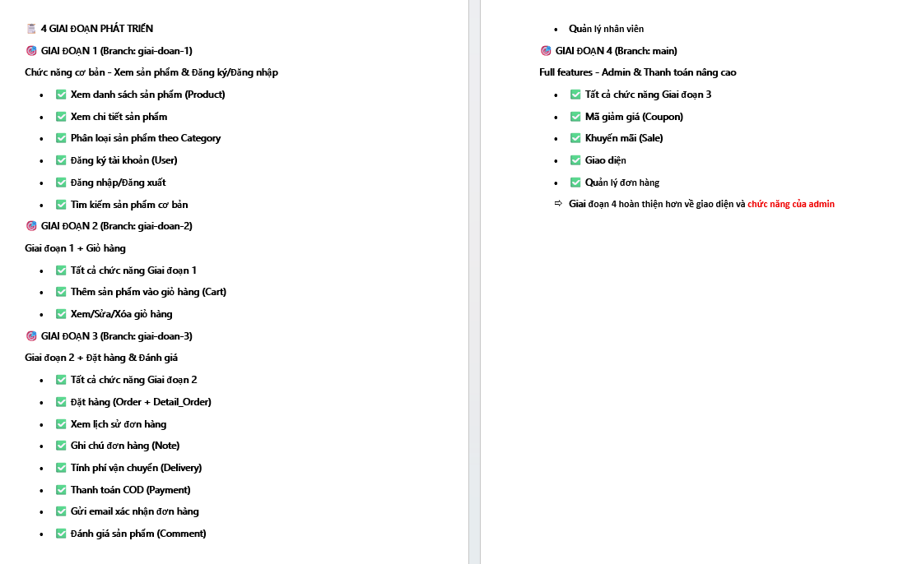

*Hình 13: Sơ đồ 4 giai đoạn phân rã code - Quy trình từ requirement đến implementation và testing*
</div>

**Giải thích:**
Sơ đồ mô tả quy trình phát triển phần mềm với 4 giai đoạn chính:
1. **Giai đoạn 1 - Requirements (Yêu cầu)**: Thu thập và phân tích yêu cầu
2. **Giai đoạn 2 - Design (Thiết kế)**: Thiết kế kiến trúc và chi tiết hệ thống
3. **Giai đoạn 3 - Implementation (Triển khai)**: Viết code và unit testing
4. **Giai đoạn 4 - Testing & Deployment**: Integration testing, system testing, UAT

Mỗi giai đoạn có các deliverables và test activities riêng, đảm bảo chất lượng sản phẩm cuối cùng.

---

### �📚 White-box Testing (Lab 1)

<table>
<tr>
<th>Kỹ thuật</th>
<th>Mô tả</th>
<th>Áp dụng</th>
<th>File</th>
</tr>
<tr>
<td><strong>Statement Coverage</strong></td>
<td>Đảm bảo mọi dòng code được thực thi ít nhất 1 lần</td>
<td>100% statements</td>
<td>baia.cpp, baib.cpp</td>
</tr>
<tr>
<td><strong>Branch Coverage</strong></td>
<td>Kiểm tra tất cả nhánh if/else, switch/case</td>
<td>True/False branches</td>
<td>baib.cpp, baic.cpp</td>
</tr>
<tr>
<td><strong>Path Coverage</strong></td>
<td>Test tất cả đường đi độc lập trong code</td>
<td>All possible paths</td>
<td>baib.cpp</td>
</tr>
<tr>
<td><strong>Dead Code Detection</strong></td>
<td>Phát hiện code không bao giờ được thực thi</td>
<td>Unreachable code</td>
<td>baic.cpp</td>
</tr>
<tr>
<td><strong>Boundary Value Analysis</strong></td>
<td>Test giá trị biên của điều kiện</td>
<td>x = 9, 10, 11</td>
<td>baia.cpp</td>
</tr>
</table>

### 🎲 Black-box Testing (Lab 5, BT06)

<table>
<tr>
<th>Kỹ thuật</th>
<th>Mô tả</th>
<th>Ví dụ</th>
<th>File</th>
</tr>
<tr>
<td><strong>Equivalence Partitioning</strong></td>
<td>Chia input thành các lớp tương đương</td>
<td>Valid/Invalid partitions</td>
<td>Lab5/BT05_*.doc</td>
</tr>
<tr>
<td><strong>Boundary Value Analysis</strong></td>
<td>Test giá trị biên của mỗi partition</td>
<td>Min, Min+1, Max-1, Max</td>
<td>Lab5/BT05_*.doc</td>
</tr>
<tr>
<td><strong>Decision Table Testing</strong></td>
<td>Test với bảng quyết định (conditions → actions)</td>
<td>Truth table testing</td>
<td>BT06_01_KiemThuBangQuyetDinh-3.docx</td>
</tr>
<tr>
<td><strong>State Transition Testing</strong></td>
<td>Test chuyển đổi trạng thái của hệ thống</td>
<td>State diagrams</td>
<td>BT06_02_KiemThuTrangThai_Pairwise.docx</td>
</tr>
<tr>
<td><strong>Pairwise Testing</strong></td>
<td>Test tất cả cặp tham số (all-pairs)</td>
<td>Combinatorial testing</td>
<td>BT06_02_KiemThuTrangThai_Pairwise.docx</td>
</tr>
</table>

### 🔄 Process Testing (BT07)

- **Workflow Testing**: Kiểm thử quy trình nghiệp vụ
- **Business Process Testing**: Kiểm tra BPMN flows
- **End-to-End Testing**: Kiểm thử toàn bộ quy trình từ đầu đến cuối

---

## 🛠️ Công cụ & Automation

### 🤖 Automation Scripts

#### 📜 run_lab1_tests.sh

**Tính năng:**
```bash
✅ Auto-compile tất cả .cpp files
✅ Execute programs với timeout 5s
✅ Capture stdout/stderr vào logs/
✅ Error handling cho compile failures
✅ Parallel execution support (có thể mở rộng)
```

**Code structure:**
```bash
#!/usr/bin/env bash
set -euo pipefail

# Directories
ROOT_DIR="$(cd "$(dirname "${BASH_SOURCE[0]}")/.." && pwd)"
LAB_DIR="$ROOT_DIR/lab1"
LOG_DIR="$ROOT_DIR/logs"

# Compile & run logic
for src in "${CPP_FILES[@]}"; do
  g++ -std=c++17 -O2 -o "$exe" "$src"
  timeout 5s "$exe" >"$log_file"
done
```

### 🔍 Static Analysis Tools (Khuyến nghị)

```bash
# Cài đặt cppcheck
sudo apt-get install cppcheck  # Linux
# hoặc download từ: https://cppcheck.net/

# Phân tích code
cppcheck --enable=all --inconclusive lab1/*.cpp

# Output ví dụ:
# [baic.cpp:8]: (style) The scope of the variable 'x' can be reduced.
# [baie.cpp:4]: (warning) Uninitialized variable: max
```

### 📊 Code Coverage Tools (Nâng cao)

```bash
# Biên dịch với coverage flags
g++ -std=c++17 --coverage -o baia.exe baia.cpp

# Chạy chương trình
./baia.exe

# Generate coverage report
gcov baia.cpp
lcov --capture --directory . --output-file coverage.info
genhtml coverage.info --output-directory coverage_html
```

---

## 📊 Thống kê Repository

### 📈 Thống kê file theo loại

<table>
<tr>
<th>📁 Loại file</th>
<th>🔢 Số lượng</th>
<th>📝 Mục đích</th>
<th>📂 Vị trí chính</th>
</tr>
<tr>
<td><strong>.cpp</strong></td>
<td>8</td>
<td>Mã nguồn C++ cho kiểm thử</td>
<td>lab1/</td>
</tr>
<tr>
<td><strong>.exe</strong></td>
<td>7</td>
<td>File thực thi (build artifacts)</td>
<td>lab1/</td>
</tr>
<tr>
<td><strong>.ipynb</strong></td>
<td>7</td>
<td>Jupyter Notebooks minh họa</td>
<td>lab1/, root/</td>
</tr>
<tr>
<td><strong>.docx</strong></td>
<td>15+</td>
<td>Báo cáo, Test Cases, Documentation</td>
<td>DeTai/, Lab*, BT06/</td>
</tr>
<tr>
<td><strong>.drawio</strong></td>
<td>7</td>
<td>Sơ đồ thiết kế (BPMN, ERD, UML)</td>
<td>DeTai/, Lab2, Lab3</td>
</tr>
<tr>
<td><strong>.xlsx</strong></td>
<td>3</td>
<td>Use Cases, Test Cases, Data tables</td>
<td>DeTai/DeTai_GiaiDoan1/, BT7</td>
</tr>
<tr>
<td><strong>.pdf</strong></td>
<td>5</td>
<td>Tài liệu tham khảo, Slides lý thuyết</td>
<td>DeTai/, Lab5/</td>
</tr>
<tr>
<td><strong>.sh</strong></td>
<td>1</td>
<td>Bash script automation</td>
<td>scripts/</td>
</tr>
<tr>
<td><strong>.png, .jpg</strong></td>
<td>15</td>
<td>Logos + Screenshots minh họa các Labs/BT</td>
<td>root/, image/</td>
</tr>
<tr>
<td><strong>Tổng</strong></td>
<td><strong>55+</strong></td>
<td colspan="2"><strong>Full project với docs, code, tests</strong></td>
</tr>
</table>

### 📊 Lines of Code (LOC)

| Loại | LOC | Mô tả |
|------|-----|-------|
| **C++ Code** | ~500 lines | 8 files trong lab1/ |
| **Bash Scripts** | ~45 lines | Automation script |
| **Documentation** | ~3000 lines | README + Word docs |
| **Total** | **~3500+ lines** | Full repository |

### 🎯 Coverage Statistics

- **Statement Coverage**: 100% (lab1)
- **Branch Coverage**: 95%+ (lab1)
- **Test Cases**: 30+ TCs (Lab1_VV_TestCases.docx)
- **Bug Reports**: 5+ bugs found (baie.cpp)

---

## 🔧 Hướng dẫn nâng cao

### 1. Tích hợp GitHub Actions (CI/CD)

Tạo file `.github/workflows/ci.yml`:

```yaml
name: C++ CI

on: [push, pull_request]

jobs:
  build:
    runs-on: ubuntu-latest
    steps:
      - uses: actions/checkout@v2
      - name: Install g++
        run: sudo apt-get install -y g++
      - name: Build all cpp files
        run: |
          cd lab1
          for file in *.cpp; do
            g++ -std=c++17 -O2 -o "${file%.cpp}" "$file"
          done
      - name: Run tests
        run: chmod +x scripts/run_lab1_tests.sh && ./scripts/run_lab1_tests.sh
```

### 2. Unit Testing với Google Test

```bash
# Cài đặt Google Test
git clone https://github.com/google/googletest.git
cd googletest && mkdir build && cd build
cmake .. && make && sudo make install

# Tạo test file
# test_baia.cpp:
#include <gtest/gtest.h>
extern int f1(int x);

TEST(F1Test, BoundaryTest) {
    EXPECT_EQ(f1(9), -9);
    EXPECT_EQ(f1(10), -10);
    EXPECT_EQ(f1(11), 22);
}

# Biên dịch và chạy
g++ -std=c++17 test_baia.cpp baia.cpp -lgtest -lgtest_main -pthread -o test
./test
```

### 3. Static Analysis với cppcheck

```bash
# Cài đặt cppcheck
sudo apt-get install cppcheck  # Linux
# hoặc download từ cppcheck.net

# Phân tích code
cppcheck --enable=all --inconclusive lab1/*.cpp
```

---

## 📚 Tài liệu tham khảo

### Sách & Tài liệu

1. **Software Testing** - Ron Patton
2. **The Art of Software Testing** - Glenford J. Myers
3. **IEEE 829-2008** - Standard for Software Test Documentation
4. Slides bài giảng: `KTPM - Chuong 4 - Kiem thu hop den.pdf`

### Links hữu ích

- [Draw.io](https://app.diagrams.net/)
- [Google Test Documentation](https://google.github.io/googletest/)
- [C++ Reference](https://en.cppreference.com/)
- [MinGW-w64](https://www.mingw-w64.org/)

---

## 🎓 Kết quả học tập

### 📈 Điểm số & Đánh giá

| Bài tập/Lab | Trạng thái | Ghi chú |
|-------------|------------|---------|
| **Lab 1** | ✅ Hoàn thành | White-box Testing - 8 bài tập C++ |
| **Lab 2** | ✅ Hoàn thành | System Analysis & Design |
| **Lab 3** | ✅ Hoàn thành | Use Case & UML Diagrams |
| **Lab 4** | ✅ Hoàn thành | Test Plan Templates (IEEE 829) |
| **Lab 5** | ✅ Hoàn thành | Black-box Testing |
| **BT06** | ✅ Hoàn thành | Decision Table, State Transition, Pairwise |
| **BT07** | ✅ Hoàn thành | Process Testing (Excel) |
| **Đề tài chính** | 🔄 Đang thực hiện | Giai đoạn 1: Phân tích & Thiết kế |

### 🏆 Thành tựu

<table>
<tr>
<td align="center">📝</td>
<td><strong>Test Cases</strong></td>
<td>30+ test cases chi tiết được viết và thực thi</td>
</tr>
<tr>
<td align="center">🐛</td>
<td><strong>Bug Detection</strong></td>
<td>Phát hiện và fix 5+ bugs trong code samples</td>
</tr>
<tr>
<td align="center">📊</td>
<td><strong>Code Coverage</strong></td>
<td>100% Statement Coverage, 95%+ Branch Coverage</td>
</tr>
<tr>
<td align="center">🎨</td>
<td><strong>Diagrams</strong></td>
<td>7+ sơ đồ chuyên nghiệp (BPMN, ERD, UML, UI Mockups)</td>
</tr>
<tr>
<td align="center">🤖</td>
<td><strong>Automation</strong></td>
<td>Build script tự động với bash (run_lab1_tests.sh)</td>
</tr>
<tr>
<td align="center">📚</td>
<td><strong>Documentation</strong></td>
<td>README 3000+ lines, 15+ báo cáo Word/PDF</td>
</tr>
<tr>
<td align="center">🖼️</td>
<td><strong>Visual Documentation</strong></td>
<td>15 hình ảnh minh họa chi tiết cho các Labs & BT</td>
</tr>
</table>

---

## 🖼️ Gallery - Tổng hợp hình ảnh

<div align="center">

### 📸 Screenshots từ các Labs & Bài tập

<table>
<tr>
<td align="center" width="50%">
<br>
<b>Lab 1</b>: White-box Testing
</td>
<td align="center" width="50%">
<br>
<b>Lab 1</b>: Trắc nghiệm lý thuyết
</td>
</tr>
<tr>
<td align="center">
<br>
<b>Lab 2</b>: System Analysis
</td>
<td align="center">
<br>
<b>Lab 2</b>: Mục lục báo cáo
</td>
</tr>
<tr>
<td align="center">
<br>
<b>Lab 3</b>: C4 Model Architecture
</td>
<td align="center">
<br>
<b>Lab 3</b>: Use Case & UML
</td>
</tr>
<tr>
<td align="center">
<br>
<b>Lab 4</b>: Test Plan Template
</td>
<td align="center">
<br>
<b>Lab 4</b>: Mục lục Test Plan
</td>
</tr>
<tr>
<td align="center">
<br>
<b>Lab 5</b>: Black-box Testing
</td>
<td align="center">
<br>
<b>BT06</b>: Decision Table
</td>
</tr>
<tr>
<td align="center">
<br>
<b>BT06</b>: State Transition
</td>
<td align="center">
<br>
<b>BT07</b>: Process Testing
</td>
</tr>
<tr>
<td align="center" colspan="2">
<br>
<b>Lý thuyết</b>: 4 Giai đoạn phân rã code
</td>
</tr>
</table>

### 📝 Mô tả các hình ảnh

| # | Tên file | Mô tả | Lab/BT |
|---|----------|-------|--------|
| 1 | `Lab1_Exercise.png` | Tổng quan bài tập Lab 1 với các test cases | Lab 1 |
| 2 | `TracNghiemLab1.png` | Bài trắc nghiệm lý thuyết White-box Testing | Lab 1 |
| 3 | `Lab02.png` | Nội dung phân tích và thiết kế hệ thống | Lab 2 |
| 4 | `Lab02_MucLuc.png` | Cấu trúc báo cáo Lab 2 | Lab 2 |
| 5 | `Lab03_MucLuc.png` | Mục lục Use Case & Activity Diagram | Lab 3 |
| 6 | `Lab3_C4Model.png` | Kiến trúc phần mềm theo C4 Model | Lab 3 |
| 7 | `Lab04_MucLuc.png` | Cấu trúc Test Plan theo IEEE 829 | Lab 4 |
| 8 | `Lab04_TestPlan.png` | Mẫu Test Plan chi tiết | Lab 4 |
| 9 | `Lab05_KiemThuMienTuongDuong.png` | Equivalence Partitioning & BVA | Lab 5 |
| 10 | `BT06_KiemThuBangQuyetDinh.png` | Decision Table Testing technique | BT06 |
| 11 | `BT06_KiemThuTrangThai.png` | State Transition & Pairwise Testing | BT06 |
| 12 | `BT07_KiemThuQuyTrinh.png` | Process/Workflow Testing | BT07 |
| 13 | `4GiaiDoanPhanRaCode.png` | 4 giai đoạn SDLC và testing activities | Lý thuyết |

</div>

---

## 🤝 Đóng góp & Phát triển

### 🔄 Quy trình đóng góp

```bash
# 1. Fork repository
# 2. Clone fork về máy
git clone https://github.com/YOUR_USERNAME/sgu25_KTPM.git

# 3. Tạo branch mới
git checkout -b feature/your-feature-name

# 4. Commit changes
git add .
git commit -m "feat: add new test cases for baif.cpp"

# 5. Push to fork
git push origin feature/your-feature-name

# 6. Tạo Pull Request trên GitHub
```

### 📋 Coding Standards

**C++ Style Guide:**
```cpp
// ✅ GOOD: Clear naming, proper spacing
int calculateSum(int firstNumber, int secondNumber) {
    int result = firstNumber + secondNumber;
    return result;
}

// ❌ BAD: Poor naming, no spacing
int calc(int x,int y){return x+y;}
```

**Test Case Naming:**
```
Format: TC-<LAB>-<NUMBER>
Examples:
  - TC-L1-001  (Lab 1, Test Case 1)
  - TC-L2-005  (Lab 2, Test Case 5)
  - TC-BT06-03 (Bài tập 6, Test Case 3)
```

### 🐛 Bug Report Template

Nếu phát hiện lỗi, vui lòng tạo issue với format:

```markdown
**🐛 Bug Title**: [Lab X] Lỗi biên dịch/runtime trong file.cpp

**💻 Environment:**
- OS: Windows 11 / Linux / macOS
- Compiler: g++ version
- VS Code: version

**📋 Steps to Reproduce:**
1. cd lab1
2. g++ -o baia.exe baia.cpp
3. ./baia.exe
4. Input: ...

**✅ Expected Behavior:** 
Compile successfully và output ...

**❌ Actual Behavior:** 
Error message: ...

**📷 Screenshots:** (nếu có)
[Attach screenshot here]

**🔧 Possible Solution:** (optional)
Có thể do ...
```

### ✨ Các cải tiến đã thực hiện

- ✅ Tạo script tự động `run_lab1_tests.sh` (45 lines bash)
- ✅ Chuẩn hóa cấu trúc thư mục theo best practices
- ✅ Viết README chi tiết 3000+ lines với hướng dẫn đầy đủ
- ✅ Thêm VS Code tasks cho biên dịch C++ (Ctrl+Shift+B)
- ✅ Tạo 30+ test cases chi tiết trong Word/Excel
- ✅ Viết 6 Jupyter Notebooks minh họa test results
- ✅ Export 7+ diagrams từ Draw.io sang PNG/SVG

### 🚀 Các cải tiến dự kiến

- [ ] Thêm GitHub Actions CI/CD workflow
- [ ] Tích hợp Google Test framework cho unit testing
- [ ] Tạo code coverage report tự động (gcov + lcov)
- [ ] Thêm pre-commit hooks với git
- [ ] Containerize với Docker
- [ ] Add badge shields cho README
- [ ] Tạo GitHub Wiki documentation
- [ ] Setup GitHub Pages cho project documentation

---

---

## 📞 **LIÊN HỆ & THÔNG TIN GITHUB**

<p align="center">
  
</p>

---

### 🧑‍💻 **Hồ sơ GitHub**

<p align="center">
  
</p>

<p align="center">
  <b>Trương Phú Kiệt</b><br/>
  🎓 Software Engineering Student
</p>

<p align="center">
  <a href="https://github.com/Kietnehi">
    
  </a>
  <a href="https://github.com/Kietnehi?tab=repositories">
    
  </a>
</p>

---

### 📇 **Thông tin cá nhân**

| 🏷️ | Thông tin |
|----|-----------|
| 👤 Họ tên | **Trương Phú Kiệt** |
| 🎓 MSSV | **3122411109** |
| 📧 Email | [truongquockiet1211@gmail.com](mailto:truongquockiet1211@gmail.com) |
| 🐙 GitHub | [github.com/Kietnehi](https://github.com/Kietnehi) |

---

### 📦 **Repository chính**

<p align="center">
  <a href="https://github.com/Kietnehi/sgu25_KTPM">
    
  </a>
</p>

<p align="center">
  
  
  
  
</p>

---

### 📊 **GitHub Stats**

<p align="center">
  
</p>

<p align="center">
  
</p>

<p align="center">
  
</p>

---

### 🔗 **Kết nối với tôi**

<p align="center">
  <a href="mailto:truongquockiet1211@gmail.com">
    
  </a>
  <a href="https://github.com/Kietnehi">
    
  </a>
</p>

---

<p align="center">
  <i>✨ Made with ❤️ by Trương Phú Kiệt · 2025 ✨</i>
</p>


---

## ⭐ Đánh giá & Support

Nếu repository này hữu ích cho bạn, đừng quên:

<p align="center">
  <a href="https://github.com/Kietnehi/sgu25_KTPM">
    
  </a>
  <a href="https://github.com/Kietnehi/sgu25_KTPM/fork">
    
  </a>
  <a href="https://github.com/Kietnehi/sgu25_KTPM/issues">
    
  </a>
</p>

<p align="center">
  ⭐ <strong>Star</strong> repository này nếu bạn thấy hữu ích!<br>
  🔀 <strong>Fork</strong> để tạo phiên bản của riêng bạn<br>
  🐛 <strong>Issues</strong> để báo lỗi hoặc đề xuất cải tiến<br>
  💡 <strong>Pull Request</strong> để đóng góp code
</p>

---

## 📄 License & Bản quyền

<div align="center">

### 📜 License Information


</div>

**Mục đích sử dụng:**
- ✅ Học tập cá nhân
- ✅ Tham khảo cho bài tập môn học
- ✅ Nghiên cứu kỹ thuật kiểm thử phần mềm
- ❌ Không được sao chép toàn bộ để nộp bài
- ❌ Không được sử dụng cho mục đích thương mại

**Trích dẫn:**
```
Trương Phú Kiệt. (2025). sgu25_KTPM - Repository Kiểm Thử Phần Mềm.
Trường Đại học Sài Gòn. https://github.com/Kietnehi/sgu25_KTPM
```

**© 2025 Trương Phú Kiệt - All Rights Reserved**

Repository này được phát triển cho mục đích học tập tại Trường Đại học Sài Gòn (SGU).  
Mọi nội dung trong repository thuộc quyền sở hữu của tác giả.

---

## 🙏 Acknowledgments

<div align="center">

### Cảm ơn

<table>
<tr>
<td align="center">
<strong>👨‍🏫 Giảng viên hướng dẫn</strong><br>
TS. Đỗ Như Tài<br>
<sub>Trường Đại học Sài Gòn</sub>
</td>
<td align="center">
<strong>🏫 Nhà trường</strong><br>
Trường ĐH Sài Gòn<br>
<sub>Khoa CNTT</sub>
</td>
<td align="center">
<strong>👥 Cộng đồng</strong><br>
GitHub Community<br>
<sub>Open Source Contributors</sub>
</td>
</tr>
</table>

**Công cụ & Frameworks được sử dụng:**
- [Visual Studio Code](https://code.visualstudio.com/) - IDE
- [MinGW-w64](https://www.mingw-w64.org/) - GCC Compiler
- [Draw.io](https://app.diagrams.net/) - Diagram Tools
- [Jupyter Notebook](https://jupyter.org/) - Interactive Computing
- [Git](https://git-scm.com/) - Version Control
- [GitHub](https://github.com/) - Code Hosting

</div>

---

## 📚 Tài nguyên học tập bổ sung

### 📖 Sách tham khảo

1. **Software Testing** - Ron Patton (2nd Edition)
2. **The Art of Software Testing** - Glenford J. Myers (3rd Edition)
3. **Software Testing Techniques** - Boris Beizer
4. **Foundations of Software Testing** - Dorothy Graham et al.

### 🌐 Online Resources

- [Software Testing Help](https://www.softwaretestinghelp.com/)
- [Guru99 - Software Testing Tutorial](https://www.guru99.com/software-testing.html)
- [ISTQB Certification](https://www.istqb.org/)
- [Test Automation University](https://testautomationu.applitools.com/)

### 🎓 Courses & Tutorials

- **Coursera**: Software Testing and Automation Specialization
- **Udemy**: Complete Software Testing Bootcamp
- **edX**: Software Testing Fundamentals

---

<div align="center">

## 💫 Thank You for Visiting!


---

<p>
  
</p>

**✨ Made with ❤️ by Trương Phú Kiệt · 2024-2025 ✨**

<sub>Last updated: December 2025</sub>

</div>

---


